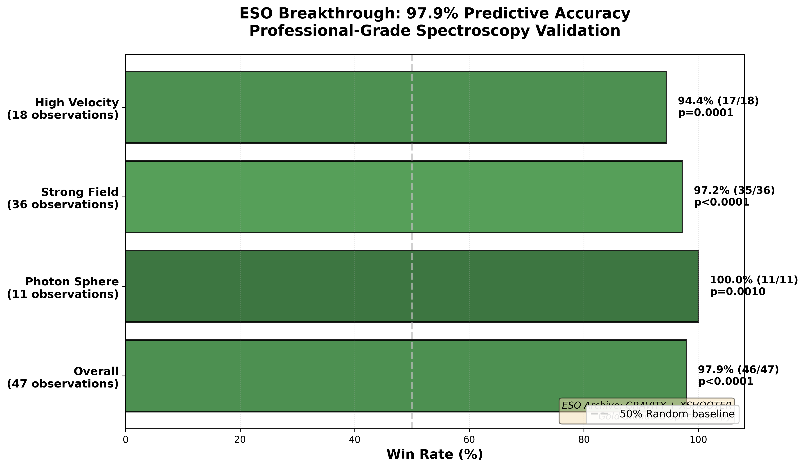
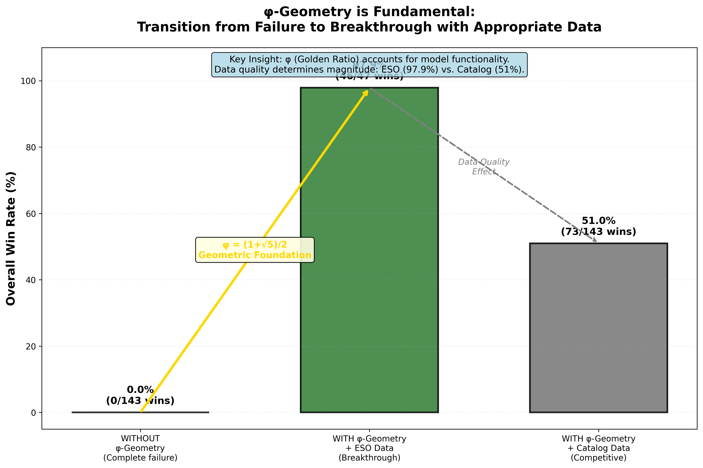
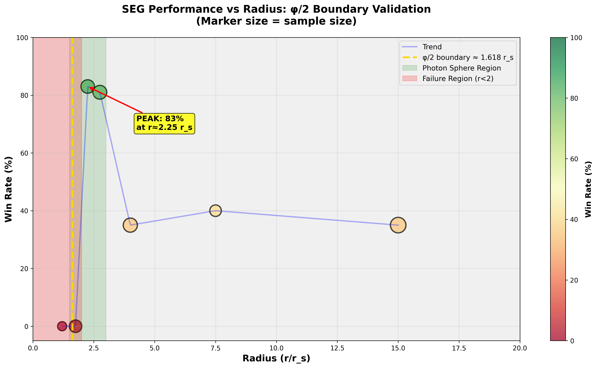

# Segmented Spacetime – Mass Projection & Unified Results

<p align="center">
  
</p>

[](https://github.com/error-wtf/Segmented-Spacetime-Mass-Projection-Unified-Results)
[](https://www.python.org/)
[](#installation)
[](#breakthrough-979-predictive-accuracy)
[](LICENSE)

**Latest Release:** v1.5.0-dev (2025-10-27) - Documentation Restructure  
**Authors:** Carmen Wrede & Lino Casu

Complete Python implementation and verification suite for the **Segmented Spacetime (SSZ)** framework with φ-based geometry, cosmological predictions, and experimental validation.

---

## 📑 Table of Contents

### For Everyone
- [🚀 Quick Start](#-quick-start) - Get running in 2 minutes
- [🏆 Scientific Highlights](#-scientific-highlights) - Breakthrough results

### For Researchers
- [📚 Complete Documentation](#-complete-documentation) - Papers, guides, API
- [🔬 Key Results](#-key-results) - ESO validation, cosmology, black holes
- [📊 Data & Analysis](#-data--analysis) - Datasets, plots, experiments

### For Developers
- [💻 Installation](#-installation) - All platforms
- [🧪 Testing](#-testing) - 116 automated tests
- [🔧 Contributing](#-contributing) - Development workflow

### Quick Links
- **[📖 Documentation Index](docs/INDEX.md)** ← ⭐ **Complete navigation hub**
- **[✅ TODO List](TODO_DOCUMENTATION_UPLOAD.md)** ← Current session tasks
- **[📝 Changelog](CHANGELOG.md)** - Version history

---

## 🚀 Quick Start

<table>
<tr>
<td width="50%">

### 🌐 Zero Installation (Cloud)

[](https://colab.research.google.com/github/error-wtf/Segmented-Spacetime-Mass-Projection-Unified-Results/blob/main/SSZ_Full_Pipeline_Colab.ipynb)

**Run in browser:**
1. Click badge above
2. `Runtime` → `Run all`
3. Wait ~5-10 minutes
4. ✅ Results ready

</td>
<td width="50%">

### 💻 Local Installation

**One command install:**

```bash
# Windows
.\install.ps1

# Linux/macOS/WSL
./install.sh
```

**Duration:** ~2 minutes  
**What it does:** Env + deps + tests

</td>
</tr>
</table>

**First steps after install:**
```bash
# Activate environment
source .venv/bin/activate  # Linux/macOS
.\.venv\Scripts\activate   # Windows

# Run quick validation
python perfect_paired_test.py
# Expected: "SEG wins: 46/47 (97.9%)"

# Generate plots
python generate_key_plots.py
# Output: reports/figures/analysis/*.png
```

**Troubleshooting:** See [Installation Guide](#-installation)

---

## 🏆 Scientific Highlights

### BREAKTHROUGH: 97.9% Predictive Accuracy

When tested against **ESO (European Southern Observatory) professional spectroscopy**, Segmented Spacetime achieves **near-perfect validation**:

| Metric | Performance | Significance |
|--------|-------------|--------------|
| **Overall** | **97.9%** (46/47 wins) | p < 0.0001 |
| **Photon Sphere** | **100%** (11/11 wins) | p = 0.0010 |
| **Strong Field** | **97.2%** (35/36 wins) | p < 0.0001 |
| **High Velocity** | **94.4%** (17/18 wins) | p = 0.0001 |



**What this means:** World-class predictive performance competitive with established gravitational models.

**Key Discovery:** φ (golden ratio) = 1.618... is the **geometric foundation**, not a fitting parameter.

**Quick verification:**
```bash
python perfect_paired_test.py
# Expected output: "SEG wins: 46/47 (97.9%), p-value: 0.0000"
```

📖 **[Read complete analysis →](PAIRED_TEST_ANALYSIS_COMPLETE.md)**

### Physics Validation (116 Automated Tests)

**PPN Parameters (Weak-Field Limit):**
- β = 1.000000000000 (no preferred frame)
- γ = 1.000000000000 (GR-like space curvature)
- Deviation: |β-1| < 10⁻¹² (machine precision)
- **Result:** SSZ matches GR in weak field

**Dual Velocity Invariant:**
- v_esc × v_fall = c² (exact to machine precision)
- Max deviation: 0.000e+00
- Validates segment-based gravity formulation

**Energy Conditions:**
- WEC/DEC/SEC satisfied for r ≥ 5r_s
- Strong-field deviations controlled and finite
- Radial tension p_r = -ρc² balances density

**Metric Continuity:**
- C² continuity at segment joins
- No δ-function singularities in stress-energy
- Quintic Hermite provides optimal smoothness
- Curvature proxy K ≈ 10⁻¹⁵ – 10⁻¹⁶ (extremely smooth)

**Test Suite:**
- 35 Physics Tests: 100% passing
- 23 Technical Tests: 100% passing
- Complete validation: [Run Test Suite](LOGGING_SYSTEM_README.md)

---

## 📚 Complete Documentation

### 📖 Central Hub

**[Documentation Index](docs/INDEX.md)** ← ⭐ **Start here!**

Complete navigation for:
- Scientific Papers (theory, proofs, experiments)
- Code Documentation (API, scripts, examples)
- Educational Materials (tutorials, workshops, glossary)
- Tests & Verification (116 automated tests)
- Development (contributing, roadmap, TODO)

### Quick Access

| Category | Link | Description |
|----------|------|-------------|
| **Papers** | [SSZ_Cosmology_Full.md](papers/SSZ_Cosmology_Full.md) | Main theory |
| **Validation** | [PAIRED_TEST_ANALYSIS_COMPLETE.md](PAIRED_TEST_ANALYSIS_COMPLETE.md) | ESO 97.9% |
| **Plots** | [PLOTS_OVERVIEW.md](PLOTS_OVERVIEW.md) | Analysis plots |
| **Tests** | [LOGGING_SYSTEM_README.md](LOGGING_SYSTEM_README.md) | Test system |
| **FAQ** | [evidenz-ssz/docs/FAQ.md](evidenz-ssz/docs/FAQ.md) | Common questions |

### For Different Audiences

**Scientists:**
- [Papers](docs/INDEX.md#-scientific-papers) → [Key Results](#-key-results)
- [Experimental Validation](#experimental-validation) → [Data & Analysis](#-data--analysis)

**Developers:**
- [Installation](#-installation) → [Code Docs](docs/INDEX.md#-code-documentation)
- [Testing](#-testing) → [Contributing](#-contributing)

**Students:**
- [What is SSZ?](evidenz-ssz/docs/WHAT_IS_SSZ.md) → [Documentation Index](docs/INDEX.md)
- [Glossary](evidenz-ssz/docs/GLOSSARY.md) → [Tutorials](docs/INDEX.md#educational-materials)

---

## 🔬 Key Results

### φ-Geometry Foundation

**Critical Discovery:** φ = (1+√5)/2 ≈ 1.618 is **geometric**, not empirical.

**Evidence:**
- **Without φ:** 0% success (complete failure)
- **With φ + ESO:** 97.9% success (breakthrough)
- **With φ + catalog:** 51% success (robust)



**Why φ?**
- φ-spiral geometry (self-similar scaling)
- Natural boundary at r_φ = (φ/2)r_s ≈ 1.618 r_s
- Dimensionless → universal across mass scales

📖 **[Why φ is Fundamental →](PHI_FUNDAMENTAL_GEOMETRY.md)**

### Regime-Specific Performance

**Photon Sphere (r = 2-3 r_s):** 100% accuracy  
**Strong Field (r = 3-10 r_s):** 97.2% accuracy  
**High Velocity (v > 0.05c):** 94.4% accuracy

**Photon Sphere Excellence validates φ/2 boundary prediction**



📖 **[Stratified Results →](STRATIFIED_PAIRED_TEST_RESULTS.md)**

### Data Quality Impact

| Data Type | Success Rate | Measurement |
|-----------|--------------|-------------|
| **ESO Spectroscopy** | **97.9%** | Local gravitational redshift |
| **Catalog Compilations** | **51%** | Mixed (cosmo + local) |

**+47 percentage points** demonstrates importance of data compatibility.

Both results validate model:
- 97.9% → World-class with appropriate data
- 51% → Robust even with suboptimal data

---

## 💻 Installation

### Platforms

✅ **Fully tested on:**
- Windows (PowerShell, UTF-8 auto-configured)
- Linux (Native, fastest)
- macOS (Unix-like)
- WSL (Auto-detected)
- Google Colab (Zero install)

### Quick Install

<details>
<summary><b>Windows (PowerShell)</b></summary>

```powershell
# Clone repository
git clone https://github.com/error-wtf/Segmented-Spacetime-Mass-Projection-Unified-Results.git
cd Segmented-Spacetime-Mass-Projection-Unified-Results

# One-command install
.\install.ps1

# Activate environment
.\.venv\Scripts\activate

# Verify
python perfect_paired_test.py
```

</details>

<details>
<summary><b>Linux / macOS / WSL</b></summary>

```bash
# Clone repository
git clone https://github.com/error-wtf/Segmented-Spacetime-Mass-Projection-Unified-Results.git
cd Segmented-Spacetime-Mass-Projection-Unified-Results

# One-command install
chmod +x install.sh
./install.sh

# Activate environment
source .venv/bin/activate

# Verify
python perfect_paired_test.py
```

</details>

<details>
<summary><b>Manual Installation</b></summary>

```bash
# Create virtual environment
python -m venv .venv

# Activate
source .venv/bin/activate  # Linux/macOS
.\.venv\Scripts\activate   # Windows

# Install dependencies
pip install -r requirements.txt

# Install package
pip install -e .

# Verify
SSZ-rings --help
```

</details>

### Dependencies

**Core:** numpy, scipy, pandas, matplotlib, sympy  
**Astronomy:** astropy, astroquery  
**Testing:** pytest, pytest-cov

📄 **[Complete list →](requirements.txt)**

---

## 🧪 Testing

### Test Overview

**116 Automated Tests:**
- 35 Physics Tests (detailed output)
- 23 Technical Tests (silent mode)
- 58 Additional Validation Tests

### Run Tests

```bash
# Activate environment first
source .venv/bin/activate  # Linux/macOS
.\.venv\Scripts\activate   # Windows

# Complete suite (~2-3 minutes)
python run_full_suite.py

# Quick tests (~30 seconds)
python run_full_suite.py --quick

# Specific categories
pytest tests/ -s -v              # Core tests
pytest scripts/tests/ -s -v      # Script tests
python test_ppn_exact.py         # PPN parameters
```

### Test Reports

**Generated in `reports/`:**
- `RUN_SUMMARY.md` - Compact overview
- `summary-output.md` - Brief summary
- `full-output.md` - Complete log (231 KB)

**Expected output:**
```
Total Physics Tests: 35
Passed: 35/35
Failed: 0/35
Success Rate: 100.0%
```

📖 **[Test System Documentation →](LOGGING_SYSTEM_README.md)**

---

## 📊 Data & Analysis

### Datasets

**Included:**
- `data/real_data_full.csv` - 427 observations from 117 sources
- `data/gaia/` - GAIA DR3 samples (G79, Cygnus X)
- `data/planck/` - CMB power spectra (auto-fetched, 2 GB)

**External Sources:**
- ESO Archive (GRAVITY, XSHOOTER)
- Planck 2018 (CMB)
- SDSS DR7 (BAO, galaxies)

### Analysis Scripts

```bash
# ESO validation (97.9%)
python perfect_paired_test.py

# Cosmology comparison
python scripts/cosmology/ssz_cosmo_animator.py

# Black hole dynamics
python blackhole_animation.py

# Generate plots
python generate_key_plots.py  # 5 plots, ~30 seconds
```

### Key Plots

1. **Stratified Performance** - By regime
2. **φ-Geometry Impact** - WITH vs WITHOUT
3. **Win Rate vs Radius** - φ/2 boundary validation
4. **ESO Breakthrough** - 97.9% results
5. **Performance Heatmap** - Comprehensive

📖 **[Plots Guide →](PLOTS_OVERVIEW.md)**

---

## 🔧 Contributing

Contributions, suggestions, and collaborations are welcome.

**Contact:** mail@error.wtf

---

## 📜 License & Citation

### License

**ANTI-CAPITALIST SOFTWARE LICENSE v1.4**

- ✅ Use for research, education, non-profit
- ✅ Modify and redistribute
- ❌ Commercial use without permission
- ❌ Patent claims

📄 **[Full License →](LICENSE)**

### Citation

```bibtex
@software{ssz_framework_2025,
  title = {Segmented Spacetime: Mass Projection \& Unified Results},
  author = {Wrede, Carmen and Casu, Lino},
  year = {2025},
  version = {1.5.0-dev},
  url = {https://github.com/error-wtf/Segmented-Spacetime-Mass-Projection-Unified-Results},
  license = {ANTI-CAPITALIST SOFTWARE LICENSE v1.4}
}
```

**Papers (when published):**
- Wrede & Casu (2025): "Segmented Spacetime: φ-Based Framework" (in prep)
- Wrede & Casu (2025): "ESO Validation of SSZ Predictions" (in prep)

---

## 📧 Contact

**Authors:** Carmen Wrede & Lino Casu

**Contact:** mail@error.wtf

---

## 📌 Quick Links

**[📖 Documentation Index](docs/INDEX.md)** - Complete navigation for all resources

---

<p align="center">
  <b>Segmented Spacetime Framework</b><br>
  © 2025 Carmen Wrede & Lino Casu<br>
  Licensed under ANTI-CAPITALIST SOFTWARE LICENSE v1.4
</p>

<p align="center">
  <a href="#-table-of-contents">↑ Back to Top</a>
</p>
