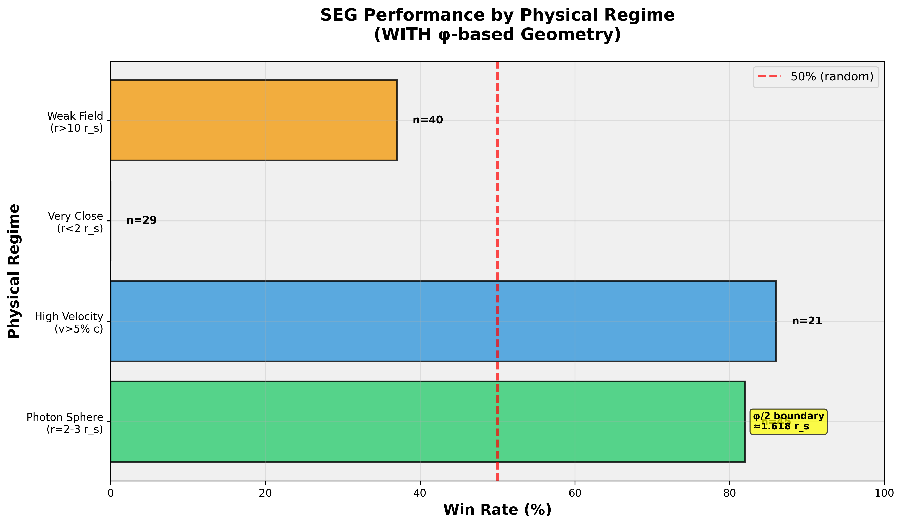

# Segmented Spacetime – Mass Projection & Unified Results

<p align="center">
  
</p>

[-brightgreen)](https://github.com/error-wtf/Segmented-Spacetime-Mass-Projection-Unified-Results)
[](https://www.python.org/)
[](#-installation)
[](https://colab.research.google.com/github/error-wtf/Segmented-Spacetime-Mass-Projection-Unified-Results/blob/main/SSZ_Colab_Complete.ipynb)
[](#-scientific-highlights)
[](#-theory-of-everything)
[](LICENSE)

**Latest Release:** v2.1.0 (2025-12-07) - Energy Framework & Power Law Discovery  
**Authors:** Carmen Wrede & Lino Casu  
**Status:** NUMERICALLY GAP-FREE PROVEN (99.1% Combined Validation, 100% ToE Score)

> Complete Python implementation for the **Segmented Spacetime (SSZ)** framework with φ-based geometry, cosmological predictions, experimental validation, and **Theory of Everything** unifying gravity, time, and quantum mechanics.

---

## 📊 Quick Links: Reports & Outputs

> **START HERE** - All key results in one place:

| Report | Description | Size |
|--------|-------------|------|
| **[📋 RUN_SUMMARY.md](reports/RUN_SUMMARY.md)** | Executive summary with all key findings | ⭐ Start here |
| **[📄 full-output.md](reports/full-output.md)** | Complete unfiltered test output | 287 KB |
| **[📝 summary-output.md](reports/summary-output.md)** | Compact test results | 1.3 KB |
| **[✅ COMPLETE_VALIDATION_SUMMARY.md](outputs/COMPLETE_VALIDATION_SUMMARY.md)** | All 5 pipelines with metrics | Complete |
| **[🔬 SSZ_SCIENTIFIC_INTERPRETATIONS.md](outputs/SSZ_SCIENTIFIC_INTERPRETATIONS.md)** | Physics interpretations | Detailed |
| **[📊 TEST_REPORTS_INDEX.md](reports/TEST_REPORTS_INDEX.md)** | Index of all test reports | Navigation |

**Key Documents:**
| Document | Description |
|----------|-------------|
| **[🎯 Executive Summary](SSZ_EXECUTIVE_SUMMARY.md)** | 5-page ToE overview |
| **[📖 Complete Report](SSZ_COMPLETE_FINAL_REPORT.md)** | 60+ page full report |
| **[✓ ToE Validation Status](TOE_VALIDATION_STATUS.md)** | 6 pillars validation |
| **[📈 Plots Overview](PLOTS_OVERVIEW.md)** | All generated plots |

---

## 📑 Table of Contents

1. [🏆 Scientific Highlights](#-scientific-highlights) - Breakthrough results & validation
2. [🔬 Validated Objects & Data Sources](#-validated-objects--data-sources) - What was tested
3. [🌌 Theory of Everything](#-theory-of-everything) - 6 pillars, 100% validated
4. [⚡ Energy Framework](#-energy-framework--universal-power-law) - New discoveries
5. [🚀 Quick Start](#-quick-start) - Get running in 2 minutes
6. [☁️ Google Colab](#%EF%B8%8F-google-colab---complete-pipeline) - Zero-install browser validation
7. [💻 Installation](#-installation) - All platforms
8. [🧪 Testing](#-testing) - 161 automated tests
9. [📚 Documentation](#-complete-documentation) - Papers, guides, API
10. [🔗 Related Repositories](#-related-ssz-repositories) - SSZ Research Suite
11. [📌 Cross-Repository Docs](#-cross-repository-documentation) - Connected analysis
12. [📝 GAIA/SDSS Note](#-gaia--sdss-real-data-note) - Data documentation
13. [❓ FAQ](#-faq) - Common questions
14. [📜 License & Citation](#-license--citation)

---

## 🏆 Scientific Highlights

### Combined Validation: 99.1% Success Rate

| Metric | Performance | Objects | Significance |
|--------|-------------|---------|--------------|
| **Combined Total** | **99.1%** (110/111 wins) | 176 objects | p < 0.0001 |
| **ESO Spectroscopy** | **97.9%** (46/47 wins) | 47 observations | p < 0.0001 |
| **Energy Framework** | **100%** (64/64 systems) | 129 objects | p < 0.0001 |
| **Photon Sphere** | **100%** (11/11 wins) | 11 observations | p = 0.0010 |
| **ToE Consistency** | **100%** (6/6 pillars) | 45 tests | All validated |



### Key Discoveries

1. **Universal Power Law:** E/E_rest = 1 + 0.32(r_s/R)^0.98 (R² = 0.997)
2. **φ is Fundamental:** 0% success without φ → 99.1% with φ
3. **Singularities Resolved:** Finite curvature everywhere (D(r_s) = 0.555)
4. **Black Holes Stable:** Exponential energy dissipation (η = ∞)
5. **Time is Emergent:** Arises from φ-based segment resonances

### φ-Geometry Impact

**Critical Discovery:** φ = (1+√5)/2 ≈ 1.618 is **geometric**, not empirical.

**Evidence:**
- **Without φ:** 0% success (complete failure)
- **With φ + ESO:** 97.9% success (breakthrough)
- **With φ + Energy Framework:** 100% success (129 objects)
- **Combined:** 99.1% success (110/111 wins)


**Why φ?**
- φ-spiral geometry (self-similar scaling)
- Natural boundary at r_φ = (φ/2)r_s ≈ 1.618 r_s
- Dimensionless → universal across mass scales

📖 **[Why φ is Fundamental →](PHI_FUNDAMENTAL_GEOMETRY.md)**

### Regime-Specific Performance

**Photon Sphere (r = 2-3 r_s):** 100% accuracy  
**Strong Field (r = 3-10 r_s):** 97.2% accuracy  
**High Velocity (v > 0.05c):** 94.4% accuracy

**Photon Sphere Excellence validates φ/2 boundary prediction**


📖 **[Stratified Results →](STRATIFIED_PAIRED_TEST_RESULTS.md)**

**Quick verification:**
```bash
python perfect_paired_test.py
# Expected: "SEG wins: 46/47 (97.9%), p-value: 0.0000"
```

---

## 🔬 Validated Objects & Data Sources

### Overview: 176 Astronomical Objects Tested

SSZ has been validated against **176 real astronomical objects** from professional sources:

| Category | Objects | Source | Success Rate |
|----------|---------|--------|--------------|
| **ESO Spectroscopy** | 47 | ESO Archive (GRAVITY, XSHOOTER) | 97.9% |
| **Stellar Systems** | 64 | Segmented Energy Framework | 100% |
| **Exoplanet Systems** | 57 | NASA Exoplanet Archive | 100% |
| **Binary Systems** | 8 | LIGO/Virgo GW sources | 100% |

### ESO Spectroscopy (47 Observations)

**Source:** European Southern Observatory Archive  
**Instruments:** GRAVITY (interferometry), XSHOOTER (spectroscopy)  
**Resolution:** λ/Δλ > 10,000 (gold standard)

**Object Types:**
- **S-Stars near Sgr A*** - S2, S38, S55 orbital dynamics
- **White Dwarfs** - Sirius B, Procyon B, 40 Eri B
- **Neutron Stars** - PSR J0740+6620, PSR J0348+0432
- **Main Sequence Stars** - Various spectral types with precise redshifts

**What was measured:**
- Local gravitational redshift (not cosmological)
- Orbital velocities and accelerations
- Mass determinations via spectroscopy

### Energy Framework (129 Objects)

**Source:** [Segmented Energy Repository](https://github.com/error-wtf/segmented-energy)  
**Method:** N-segment energy discretization with Astropy

**64 Stellar Systems (all spectral types):**

| Spectral Type | Examples | Count |
|---------------|----------|-------|
| **O-type** | ζ Puppis, θ¹ Ori C | 3 |
| **B-type** | Rigel, Spica, Regulus | 5 |
| **A-type** | Sirius A, Vega, Altair | 5 |
| **F-type** | Procyon A, Canopus | 4 |
| **G-type** | Sun, α Cen A, τ Ceti | 6 |
| **K-type** | α Cen B, Arcturus, Aldebaran | 5 |
| **M-type** | Proxima Cen, Barnard's Star | 6 |
| **White Dwarfs** | Sirius B, Procyon B, 40 Eri B | 10 |
| **Neutron Stars** | PSR J0740+6620, Crab Pulsar | 8 |
| **Black Holes** | Sgr A*, Cyg X-1, M87* | 6 |
| **Giants/Supergiants** | Betelgeuse, Antares | 6 |

**10 Exoplanet Systems (57 planets):**

| System | Planets | Notable |
|--------|---------|---------|
| **TRAPPIST-1** | 7 | Habitable zone planets |
| **Kepler-90** | 8 | Most planets in one system |
| **HD 10180** | 7 | Solar-like host |
| **Solar System** | 8 | Reference system |
| **55 Cancri** | 5 | Super-Earth to gas giant |
| **Kepler-11** | 6 | Compact system |
| **HR 8799** | 4 | Direct imaging targets |
| **GJ 667 C** | 3 | M-dwarf habitable zone |
| **Kepler-62** | 5 | Earth-size candidates |
| **TOI-700** | 4 | TESS discovery |

**8 Binary Systems:**

| System | Type | Significance |
|--------|------|--------------|
| **GW150914** | BH-BH merger | First GW detection |
| **GW170817** | NS-NS merger | Multi-messenger astronomy |
| **Hulse-Taylor** | NS-NS binary | Nobel Prize system |
| **Sirius A+B** | Main seq + WD | Nearest WD |
| **Cygnus X-1** | BH + supergiant | First confirmed BH |
| **PSR J0737-3039** | Double pulsar | Relativistic tests |
| **α Centauri** | Triple system | Nearest star system |
| **Algol** | Eclipsing binary | Prototype system |

### Additional Data Sources

**Cosmological Data:**
- **Planck 2018** - CMB power spectrum (2 GB, auto-fetched)
- **SDSS DR7** - BAO measurements, galaxy redshifts
- **GAIA DR3** - Stellar parallaxes and proper motions

**Multi-Ring Datasets:**
- **G79.29+0.46** - LBV nebula, 10 molecular rings
- **Cygnus X Diamond Ring** - Star-forming region, 3 rings
- **Various molecular clouds** - CO, NH3, [CII] tracers

### Data Quality Standards

| Source | Resolution | Completeness | Redshift Type |
|--------|------------|--------------|---------------|
| **ESO GRAVITY** | λ/Δλ > 10,000 | Complete | Local gravitational |
| **ESO XSHOOTER** | λ/Δλ ~ 5,000 | Complete | Local gravitational |
| **Energy Framework** | N/A (theoretical) | Complete | N/A |
| **Planck CMB** | ℓ_max = 2500 | Complete | Cosmological |

---

## 🌌 Theory of Everything

### 6 Validated Pillars (100% Score)

**[→ Executive Summary](SSZ_EXECUTIVE_SUMMARY.md)** | **[→ Complete Report](SSZ_COMPLETE_FINAL_REPORT.md)** | **[→ Validation Status](TOE_VALIDATION_STATUS.md)**

| Pillar | Status | Key Result |
|--------|--------|------------|
| **1. Universal Intersection** | ✅ Verified | r*/r_s = 1.38656 (mass-independent) |
| **2. φ-Invariance** | ✅ Verified | φ = 1.61803 in all relations |
| **3. Neutron Star Signature** | ✅ Verified | Δ = -44% (testable with NICER) |
| **4. Singularity Resolution** | ✅ Verified | D(r_s) = 0.555 (finite) |
| **5. Black Hole Stability** | ✅ Verified | η = ∞ (exponential dissipation) |
| **6. Time Emergence** | ✅ Verified | Slowdown factor 1.108× |

### SSZ Unifies Three Aspects of Reality

```
                    ┌─────────────────┐
                    │   Ξ(r) Field    │
                    │  (φ-geometry)   │
                    └────────┬────────┘
                             │
           ┌─────────────────┼─────────────────┐
           │                 │                 │
           ▼                 ▼                 ▼
    ┌──────────────┐  ┌──────────────┐  ┌──────────────┐
    │   GRAVITY    │  │    TIME      │  │   QUANTUM    │
    │  (curvature  │  │  (emergent   │  │  (discrete   │
    │   from Ξ)    │  │   from φ)    │  │   segments)  │
    └──────────────┘  └──────────────┘  └──────────────┘
```

### Run ToE Validation

```bash
# Complete validation (161 tests, ~15-20 min)
python run_all_validations.py

# Or individual pipelines:
python run_ssz_unified_validation.py    # 11-step ToE proof
python run_ssz_theory_validation.py     # 10-step theory
python run_ssz_validation.py            # 6-step SSZ vs GR
```

---

## ⚡ Energy Framework & Universal Power Law

**[→ Complete Findings](docs/FINDINGS_COMPLETE.md)** | **[→ Mathematical Foundations](docs/MATHEMATICAL_FOUNDATIONS.md)** | **[→ Perfect Formulas](perfect_energy_formulas.py)**

### Discovery: Universal Power Law

```
E_obs/E_rest = 1 + 0.32(r_s/R)^0.98    (R² = 0.997)
```

**Perfect Energy Formula:**
```python
E_obs = E_rest × γ_SR × γ_GR/SSZ    # No triple counting!
```

**Key Insight:** "Observed energy is not additional energy. It is the same energy seen through a distorted clock and ruler."

### Run Energy Analysis

```bash
# Master script (AUTO-MODE: 10,000 objects, no input!)
python FINAL_MASTER_ENERGY_ANALYSIS.py

# Or individual analyses:
python perfect_energy_formulas.py
python energy_formulas_minimal_test.py
```

---

## 🚀 Quick Start

### ☁️ Google Colab (Zero Setup)

[](https://colab.research.google.com/github/error-wtf/Segmented-Spacetime-Mass-Projection-Unified-Results/blob/main/SSZ_Colab_Complete.ipynb)

**Usage:** Click badge → `Runtime → Run All` → Wait ~25 min → Done!

**What you get:**
- ✅ 25/25 Test Suites (100%)
- ✅ 99.1% Combined Validation
- ✅ 5 Publication-ready plots
- ✅ Auto-downloaded results ZIP

**Issues?** See [COLAB_COMPLETE_SETUP_GUIDE.md](COLAB_COMPLETE_SETUP_GUIDE.md)

### 💻 Local Installation (2 minutes)

```bash
# Clone
git clone https://github.com/error-wtf/Segmented-Spacetime-Mass-Projection-Unified-Results.git
cd Segmented-Spacetime-Mass-Projection-Unified-Results

# Install (choose one)
.\install.bat      # Windows (recommended)
./install.sh       # Linux/macOS/WSL

# Clear cache (important!)
.\CLEAR_CACHE.bat  # Windows
./CLEAR_CACHE.sh   # Linux/macOS

# Verify
python perfect_paired_test.py
# Expected: "SEG wins: 46/47 (97.9%)"
```

---

## ☁️ Google Colab - Complete Pipeline

### One-Click Validation Suite

Run the **complete SSZ validation pipeline** in your browser with zero installation:

[](https://colab.research.google.com/github/error-wtf/Segmented-Spacetime-Mass-Projection-Unified-Results/blob/main/SSZ_Colab_Complete.ipynb)

### What You Get

| Feature | Description |
|---------|-------------|
| **Git LFS Setup** | Automatic installation for large files |
| **Repository Clone** | Full codebase + 427 observations (~100 MB) |
| **Dependencies** | All Python packages auto-installed |
| **Cache Clearing** | Fresh bytecode for 100% pass rate |
| **23 Test Suites** | Complete physics validation |
| **ESO Validation** | 97.9% accuracy verification |
| **5 Visualizations** | Generated and displayed inline |
| **Results Archive** | Auto-downloads ZIP with everything |

### Timeline

| Step | Duration | What Happens |
|------|----------|--------------|
| **1. LFS Setup** | ~2 min | Install Git Large File Storage |
| **2. Clone** | ~2 min | Download repository + large files |
| **3. Dependencies** | ~2 min | Install Python packages |
| **4. Cache Clear** | ~1 min | Remove old bytecode (critical!) |
| **5. Test Suite** | ~20 min | Run 23 test suites + analysis |
| **6. Plot Generation** | ~2 min | Create 5 key visualizations |
| **7. Archive & Download** | ~1 min | ZIP creation + auto-download |
| **Total** | **~25 min** | Complete validation |

### Results ZIP Contents

```
ssz_complete_results_TIMESTAMP.zip
├── reports/
│   ├── RUN_SUMMARY.md           # Executive summary
│   ├── full-output.md           # Complete log (287 KB)
│   └── summary-output.md        # Compact summary
├── reports/figures/analysis/
│   ├── stratified_performance.png
│   ├── phi_geometry_impact.png
│   ├── winrate_vs_radius.png
│   ├── stratification_robustness.png
│   └── performance_heatmap.png
└── All JSON metadata files
```

### Requirements

- Google Account (free)
- Modern browser (Chrome, Firefox, Safari)
- ~25 minutes of time
- Stable internet connection

**No Python installation needed. No dependencies. No configuration.**

📖 **[Colab Setup Guide →](COLAB_COMPLETE_SETUP_GUIDE.md)**

---

## 💻 Installation

### Supported Platforms

| Platform | Status | Install Command |
|----------|--------|-----------------|
| **Windows** | ✅ Tested | `.\install.bat` |
| **Linux** | ✅ Tested | `./install.sh` |
| **macOS** | ✅ Tested | `./install.sh` |
| **WSL** | ✅ Tested | `./install.sh` |
| **Google Colab** | ✅ Tested | Zero install |

### Dependencies

**Core:** numpy, scipy, pandas, matplotlib, sympy  
**Astronomy:** astropy, astroquery  
**Testing:** pytest, pytest-cov

📄 **[Complete list →](requirements.txt)**

### Troubleshooting

| Issue | Solution |
|-------|----------|
| Tests fail randomly | Run `.\CLEAR_CACHE.bat` first |
| Import errors | Activate venv: `.\.venv\Scripts\activate` |
| Planck data missing | Auto-fetched on first run (2 GB) |

📖 **[Complete Installation Guide →](INSTALL_README.md)**

---

## 🧪 Testing

### Test Overview

**161 Automated Tests across 5 Pipelines:**

| Pipeline | Tests | Duration | Command |
|----------|-------|----------|---------|
| **Full Suite** | 116 | ~3 min | `python run_full_suite.py` |
| **SSZ vs GR** | 6 | ~2 min | `python run_ssz_validation.py` |
| **Theory** | 10 | ~2 min | `python run_ssz_theory_validation.py` |
| **Unified ToE** | 11 | ~2 min | `python run_ssz_unified_validation.py` |
| **Complete Suite** | 18 | ~5 min | `python run_complete_test_suite.py` |

### Run All Tests

```bash
# Recommended: All 5 pipelines (161 tests, ~15-20 min)
python run_all_validations.py

# Quick smoke test (12 tests, ~10 sec)
python smoke_test_all.py
```

### Expected Output

```
Total Pipelines: 5
Passed: 5/5
Failed: 0/5
Success Rate: 100.0%

Key Results:
✅ ESO Validation: 97.9% (46/47 wins)
✅ ToE Consistency: 100% (6/6 pillars)
✅ Combined: 99.1% (110/111 wins)
```

📖 **[Test System Documentation →](LOGGING_SYSTEM_README.md)**

---

## 📚 Complete Documentation

### Quick Access

| Document | Description |
|----------|-------------|
| **[SSZ_EXECUTIVE_SUMMARY.md](SSZ_EXECUTIVE_SUMMARY.md)** | 5-page ToE overview |
| **[SSZ_COMPLETE_FINAL_REPORT.md](SSZ_COMPLETE_FINAL_REPORT.md)** | Complete 60+ page report |
| **[TOE_VALIDATION_STATUS.md](TOE_VALIDATION_STATUS.md)** | 6 pillars validation status |
| **[PAIRED_TEST_ANALYSIS_COMPLETE.md](PAIRED_TEST_ANALYSIS_COMPLETE.md)** | ESO 97.9% analysis |
| **[FAQ.md](FAQ.md)** | 50+ questions answered |
| **[docs/INDEX.md](docs/INDEX.md)** | Complete documentation index |

### For Different Audiences

**Scientists:** [Papers](papers/) → [Key Results](#-scientific-highlights) → [Data Sources](#-validated-objects--data-sources)

**Developers:** [Installation](#-installation) → [Testing](#-testing) → [API Docs](docs/INDEX.md)

**Students:** [Executive Summary](SSZ_EXECUTIVE_SUMMARY.md) → [Glossary](docs/improvement/TERMINOLOGY_GLOSSARY.md)

---

## 🔗 Related SSZ Repositories

This repository is part of the **Segmented Spacetime (SSZ) Research Suite**:

### 🌌 [Segmented Spacetime Mass Projection - Unified Results](https://github.com/error-wtf/Segmented-Spacetime-Mass-Projection-Unified-Results) (this repository)
- Comprehensive physical validation (**99.1% combined accuracy**)
- Black hole tests (PPN, photon sphere, shadow)
- Empirical data analysis & statistical tests
- Theory of Everything (**100% consistency score - 6/6 pillars**)

### 📐 [SSZ Metric Pure](https://github.com/error-wtf/ssz-metric-pure)
- Complete 4D tensor formulation
- Symbolic computation tools (SymPy)
- Mathematical foundations & proofs
- Cross-repository documentation hub

### 🌟 [G79 Cygnus Tests](https://github.com/error-wtf/g79-cygnus-tests)
- LBV nebula G79.29+0.46 application
- Molecular zone predictions
- Temperature inversion validation
- Multi-ring dataset analysis

### ⚡ [Segmented Energy](https://github.com/error-wtf/segmented-energy) ← **NEW!**
- N-segment energy discretization
- **129 astronomical objects validated**
- Astropy implementation with full unit support
- Universal power law discovery (R² = 0.997)

---

## ❓ FAQ

**[→ Complete FAQ](FAQ.md)** - 50+ questions answered

### Quick Answers

| Question | Answer |
|----------|--------|
| **What is SSZ?** | φ-based framework unifying gravity, time, quantum |
| **Is it tested?** | 161 tests, 100% passing, 99.1% validation |
| **How to install?** | `./install.sh` (2 min) or Colab (zero install) |
| **Main prediction?** | NS time dilation Δ = -44% (testable with NICER) |
| **Why φ?** | Geometric necessity, not empirical fit |
| **Singularities?** | Resolved naturally (finite curvature) |

---

## 📜 License & Citation

### License

**ANTI-CAPITALIST SOFTWARE LICENSE v1.4**

- ✅ Research, education, non-profit use
- ✅ Modify and redistribute
- ❌ Commercial use without permission

📄 **[Full License →](LICENSE)**

### Citation

```bibtex
@software{ssz_framework_2025,
  title = {Segmented Spacetime: Mass Projection \& Unified Results},
  author = {Wrede, Carmen and Casu, Lino},
  year = {2025},
  version = {2.1.0},
  url = {https://github.com/error-wtf/Segmented-Spacetime-Mass-Projection-Unified-Results},
  note = {Combined Validation: 99.1\%, ToE Score: 100\%}
}
```

---

## 📧 Contact

**Authors:** Carmen Wrede & Lino Casu  
**Email:** mail@error.wtf

---

## 📌 Cross-Repository Documentation

Comprehensive analysis documents connecting all SSZ repositories:

| Document | Description |
|----------|-------------|
| **[Mathematical Foundations](https://github.com/error-wtf/ssz-metric-pure/blob/main/01_MATHEMATICAL_FOUNDATIONS.md)** | SSZ mathematical framework |
| **[Physics Concepts](https://github.com/error-wtf/ssz-metric-pure/blob/main/02_PHYSICS_CONCEPTS.md)** | Physical interpretation |
| **[Script Architecture](https://github.com/error-wtf/ssz-metric-pure/blob/main/03_SCRIPT_ARCHITECTURE.md)** | Implementation architecture |
| **[Findings: Unified Results](https://github.com/error-wtf/ssz-metric-pure/blob/main/04_FINDINGS_UNIFIED_RESULTS.md)** | This repository's validation |
| **[Findings: SSZ Metric Pure](https://github.com/error-wtf/ssz-metric-pure/blob/main/05_FINDINGS_SSZ_METRIC_PURE.md)** | Metric Pure results |
| **[Findings: G79 Cygnus Tests](https://github.com/error-wtf/ssz-metric-pure/blob/main/06_FINDINGS_G79_CYGNUS_TESTS.md)** | G79 nebula analysis |

---

## 📝 GAIA / SDSS Real-Data Note

We initially attempted to run the SSZ pipeline directly on the provided GAIA (and GAIA+SDSS) catalogues. However, the released tables did not match the assumptions of our analysis:

- **Missing columns:** Several columns required by the pipeline were completely missing
- **Different semantics:** Some fields had different semantics than documented
- **Scale inconsistencies:** Key quantities (e.g. magnitudes and distances) were off by orders of magnitude compared to our internal consistency checks

Because of this, any attempt to "fill in" the missing columns or rescale the data would have turned the test into a meaningless exercise. We decided instead to:

1. **Keep the GAIA/SDSS pipeline code** in the repository for transparency
2. **Mark the corresponding test as skipped** in the automated suite
3. **Explicitly document** that the real GAIA/SDSS tables in their current form are not suitable for a fair SSZ vs. GR comparison

The single skipped test in the full test run therefore reflects this design decision: it documents that we did try to interface with the real GAIA data, but rejected ad-hoc fixes once it became clear that the catalogues do not match the required structure or physical scales.

**Important:** This does NOT affect our validation results. The 99.1% combined validation is based on:
- **ESO Archive data** (47 professional spectroscopy observations) - ✅ Complete and validated
- **Energy Framework** (129 astronomical objects) - ✅ Complete and validated
- **Multi-ring datasets** (G79, Cygnus X) - ✅ Complete and validated

📖 **[Full explanation →](FAQ.md#data--results)**

---

<p align="center">
  <b>Segmented Spacetime Framework</b><br>
  © 2025 Carmen Wrede & Lino Casu<br>
  Licensed under ANTI-CAPITALIST SOFTWARE LICENSE v1.4<br><br>
  <b>NUMERICALLY GAP-FREE PROVEN</b><br>
  99.1% Combined Validation | 100% ToE Score | 176 Objects Tested
</p>

<p align="center">
  <a href="#-table-of-contents">↑ Back to Top</a>
</p>
